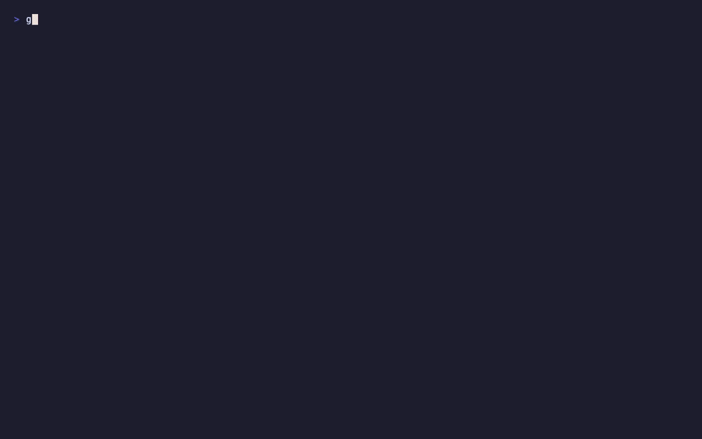

<div align="center">


# Background Check for AI Agents

**Discover, assess, red-team, and _enforce_ security across your AI agents —
and the MCP supply chain behind them.**
Local-first. No account required.

[](https://www.npmjs.com/package/@guard0/g0)
[](https://nodejs.org)
[](LICENSE)
[](https://owasp.org/www-project-agentic-security/)
[](https://github.com/guard0-ai/g0/actions)

</div>

> **You wouldn't hire someone without a background check.**
> **Why would you deploy an AI agent without one?**

```bash
npx @guard0/g0 check        # is anything on this machine known-malicious?
npx @guard0/g0 scan .       # background-check an agent codebase
```

One command. Sixty seconds. It finds every AI tool, MCP server, and installed
skill on your machine, checks them against the known-malicious database
(ClawHavoc campaign IOCs, malicious MCP servers, infostealer artifacts), and
hands you a grade — capped at F with exit code 1 if anything known-bad is found.

<div align="center">

</div>

AI agents — and the **tools, MCP servers, and models** behind them — ship faster than anyone can track. g0 background-checks the whole estate: it discovers every component **on a laptop, in a repo, in CI, and across a fleet**, grades it against 1,128 rules in 12 domains, red-teams behavior with 1,200+ payloads, **enforces policy on live MCP traffic**, and hands you a signed, standards-mapped record you can give an auditor.

## The report card

Every scan ends in a grade you can act on — not a wall of findings:

```
  ./my-banking-agent  ·  langchain (+mcp)  ·  14 files  ·  1.2s

  CRITICAL  Shared memory between users            main.py:8   [AA-DL-046]
            Fix: isolate memory per user_id/session.  OWASP:ASI07
  HIGH      System prompt has no scope boundaries   main.py:21  [AA-GI-001]
            Fix: add role, task boundaries, output constraints.
  HIGH      Database tool without input validation  tools.py:34 [AA-TS-002]
  + 18 more across 12 domains

  CRIT 2   HIGH 5   MED 6   LOW 6   INFO 2         Total: 21

  Goal Integrity   ██████████████████░░░░░░░░░░  60
  Code Execution   ████████████████░░░░░░░░░░░░  52
  Data Leakage     █████████████████████████░░  82

  ─────────────────────────────────────────────────────
  C   ████████████████████████████░░░░░░░░  68
  ⚠  Grade capped: 2 critical findings present
```

The grade is **capped** when criticals are present, so a project with serious issues can never read as healthy — no matter how clean the rest looks. Every finding carries a one-line fix and maps to **OWASP, NIST, ISO 42001, and the EU AI Act**.

## What a background check covers

Point scanners check one repo. g0 covers the surfaces attackers actually use — the developer endpoint, the MCP supply chain, and the whole fleet — and keeps re-validating as things change.

|  | Surface | What it does |
|---|---|---|
| 🖥️ | **[Endpoint](docs/endpoint-monitoring.md)** | Discover the 19 AI dev tools & MCP servers on a machine — plus agentic browsers (`--agentic-browser`) and known-malicious servers (`endpoint quarantine`, dry-run by default). No server-side scanner can see this. |
| 🔬 | **[Scan](docs/rules.md)** | 1,128 rules across 12 domains, taint tracking, cross-file exfil analysis, and an A–F grade — for Python, TS/JS, Java, and Go. |
| 🧪 | **[Red-team](docs/dynamic-testing.md)** | 1,200+ adversarial payloads, a 4-level judge cascade, and CVSS scoring against a live agent, HTTP endpoint, or MCP server. |
| 🔌 | **[MCP supply chain](docs/mcp-security.md)** | Assess MCP servers from config + source, score per-skill trust, detect rug-pulls, and verify a package before you install it. |
| 🛡️ | **[Runtime proxy](docs/runtime-proxy.md)** | Sit in the live path with a confidence-scored engine: checksum-validated secret detection, Exact-Data-Match, dataflow provenance — `deny`, `redact`, `coach`, or `alert` on every tool call. |
| 🔒 | **[Protect](docs/protect.md)** | One command that installs the guardrails — MCP proxy routing, known-malicious quarantine, and [Claude Code hook enforcement](docs/hooks.md) covering built-in Bash/file-write tools no MCP proxy can see. Dry-run first, fully undoable with `protect off`. |
| 📦 | **[Inventory](docs/inventory.md)** | A signed **CycloneDX 1.6 AI-BOM** of every model, tool, agent, and MCP server — content-addressed so it diffs across releases. |
| 🛰️ | **[Fleet](docs/fleet.md)** | Estate roll-up and drift across every repo and machine you track, with signed **[attestation packs](docs/attestation.md)** for audit. |
| 🧩 | **[Inside your IDE](docs/mcp-server.md)** | Run g0 _as_ an MCP server (`g0 mcp serve`) so Claude Code, Cursor, and Windsurf can scan and vet servers from the chat. |

## 60-second tour

```bash
g0 check                                 # the background check: estate + skills vs known-malicious DB
g0 protect --apply                       # install the guardrails: proxy routing + quarantine, undoable
g0 endpoint                              # audit AI tools & MCP configs on this machine
g0 scan ./my-agent                       # graded security assessment (1,128 rules)
g0 proxy install                         # route your IDE's MCP servers through g0
g0 test --target http://localhost:3000/api/chat   # red-team a live agent
g0 inventory . --cyclonedx --sign-key k  # signed AI Bill of Materials
g0 gate . --min-score 80                 # fail CI on policy violations
```

## 🛡️ Runtime enforcement — `g0 proxy`

Static scanning tells you a server _looks_ risky. The proxy sits on the live stdio traffic between your IDE/agent and the real MCP server, and makes a **confidence-scored decision on every request and response** — not shallow regex matching:

- **Validator-gated secrets** — Luhn/IBAN/vendor-key checksums (AWS, OpenAI, GitHub, Slack, JWT). A candidate that fails its checksum produces *no finding*.
- **Exact-Data-Match** — fingerprint real secrets once (`g0 proxy fingerprint`, salted hashes only); the proxy then catches that *exact* data anywhere in traffic, including exfil attempts.
- **Provenance / dataflow** — flags sensitive data that leaves one tool's response and reappears in a *different* tool's request — the confused-deputy pattern — including reads of `~/.ssh` and `.env`.
- **Graduated outcomes** — every signal fuses into one calibrated score, mapped via `deny > redact > coach > alert > allow`. `coach` warns loudly but never blocks — built for corroborated-but-not-certain signal.

```bash
g0 proxy install                                   # route an IDE's MCP servers through g0 (backs up configs)
g0 proxy fingerprint prod-secrets.txt --name prod  # EDM index — plaintext never persists
g0 proxy status                                    # proxied servers + denied / redacted / coached (24h)
```

Fail-open by design — it never bricks your IDE. `version: 1` policies keep working byte-identically. → **[docs/runtime-proxy.md](docs/runtime-proxy.md)**

## Coverage

<table>
<tr>
<td width="50%">

**12 Security Domains**

Goal Integrity · Tool Safety · Identity & Access · Supply Chain · Code Execution · Memory & Context · Data Leakage · Cascading Failures · Human Oversight · Inter-Agent · Reliability Bounds · Rogue Agent

</td>
<td width="50%">

**10 Compliance Standards**

OWASP Agentic Top 10 · NIST AI RMF · ISO 42001 · ISO 23894 · OWASP AIVSS · OWASP Agentic AI Top 10 · AIUC-1 · EU AI Act · MITRE ATLAS · OWASP LLM Top 10

</td>
</tr>
<tr>
<td>

**10 Framework Parsers** (+ generic fallback)

LangChain/LangGraph · CrewAI · OpenAI Agents SDK · MCP · Vercel AI SDK · Amazon Bedrock · AutoGen · LangChain4j · Spring AI · Go AI

</td>
<td>

**Deep analysis**

Pipeline taint tracking · cross-tool correlation · cross-file exfiltration · analyzability scoring · description-behavior alignment · multi-ecosystem threat feed

</td>
</tr>
</table>

<table align="center">
<tr>
<td align="center"><strong>1,128</strong><br><sub>Security Rules</sub></td>
<td align="center"><strong>1,200+</strong><br><sub>Attack Payloads</sub></td>
<td align="center"><strong>25</strong><br><sub>Attack Categories</sub></td>
<td align="center"><strong>19</strong><br><sub>Dev Tools Detected</sub></td>
<td align="center"><strong>5</strong><br><sub>Languages</sub></td>
</tr>
</table>

## Use it in CI & your IDE

**GitHub Actions** — scan, gate, upload SARIF, and post a sticky PR comment with a severity table and score delta:

```yaml
- uses: guard0-ai/g0@v2
  with:
    path: '.'
    min-score: '70'
    fail-on: 'high'
```

**Any CI** — `g0 scan . --junit results.xml` emits JUnit XML that Jenkins, GitLab, and CircleCI render natively. `g0 gate . --baseline` fails only on findings *new* since your baseline — adopt g0 without drowning in pre-existing debt.

**Pre-commit** — `g0 init --hooks` generates the hook for your setup (husky, lefthook, or standalone `.git/hooks`), auto-detected.

**Claude Code / Cursor / Windsurf** — let your agent run g0 directly:

```bash
claude mcp add g0 -- npx -y @guard0/g0 mcp serve
```

See [docs/ci-cd.md](docs/ci-cd.md) and [docs/mcp-server.md](docs/mcp-server.md).

## Connect to the Guard0 Platform

g0 is offline-first — everything above runs locally with no account. Signing in is optional (`g0 login`) and unlocks a **premium real-time threat feed** plus org-wide dashboards on the [Guard0 Platform](https://guard0.ai/signup). It never uploads your scans and never blocks a scan. → [docs/platform.md](docs/platform.md)

## Commands

| Command | Purpose |
|---|---|
| `g0 check [path]` | One-command background check — endpoint estate + installed skills vs the known-malicious DB, graded; exit 1 on malicious |
| `g0 endpoint` | Discover AI dev tools & MCP server configs — `--agentic-browser`, `quarantine [--apply/--undo]` |
| `g0 scan [path]` | Security assessment with A–F grading — `--json`, `--sarif`, `--junit`, `--ci` |
| `g0 test` | Adversarial red-teaming — 1,200+ payloads, CVSS scoring |
| `g0 proxy install/status/fingerprint` | Runtime enforcement on live MCP traffic — deny/redact/coach/alert |
| `g0 mcp [path]` / `mcp serve` / `mcp audit-skills` | Assess MCP servers · run g0 as an MCP server · per-skill trust audit |
| `g0 inventory [path]` | AI-BOM — signed CycloneDX 1.6, content-addressed |
| `g0 fleet scan/status/drift/list` | Estate roll-up and drift across repos & machines |
| `g0 attest [path]` | Signed, standards-mapped attestation pack |
| `g0 flows [path]` | Execution-path mapping and toxic-flow detection |
| `g0 gate [path]` | CI/CD gate — thresholds + diff-based regression mode |
| `g0 rules list/describe` | Browse all 1,128 rules; inspect any rule's checks & standards |
| `g0 daemon` | Background monitoring — running-agent watcher, cognitive-file drift checks |
| `g0 detect` | MDM enrollment, running AI agents, host hardening posture |
| `g0 init [--hooks]` | Create `.g0.yaml` · generate pre-commit hooks (husky/lefthook/standalone) |
| `g0 config validate` | Validate `.g0.yaml` / policy config before CI does |
| `g0 login` / `logout` / `whoami` | Connect the CLI to your guard0.ai account (optional) |

Every command supports `--json`. Full reference in [the docs](docs/).

## Documentation

| | |
|---|---|
| [Getting Started](docs/getting-started.md) | [Runtime Proxy](docs/runtime-proxy.md) |
| [Rules Reference](docs/rules.md) · [Custom Rules](docs/custom-rules.md) | [MCP Security](docs/mcp-security.md) · [g0 as an MCP Server](docs/mcp-server.md) |
| [Scoring](docs/scoring.md) · [Findings](docs/findings.md) | [Endpoint Assessment](docs/endpoint-monitoring.md) |
| [AI Inventory](docs/inventory.md) · [Attestation](docs/attestation.md) | [Fleet Control Plane](docs/fleet.md) |
| [Dynamic Testing](docs/dynamic-testing.md) | [CI/CD Integration](docs/ci-cd.md) |
| [Compliance Mapping](docs/compliance.md) | [Platform & Authentication](docs/platform.md) |
| [Frameworks](docs/frameworks.md) · [Architecture](docs/architecture.md) | [OpenClaw Security](docs/openclaw-security.md) · [Deployment](docs/openclaw-deployment-guide.md) |
| [Programmatic API](docs/api.md) | [Enforcement Integrations](docs/enforcement-integrations.md) |
| [Validation Report](docs/validation-report.md) | [FAQ](docs/faq.md) · [Glossary](docs/glossary.md) |

## Contributing

See [CONTRIBUTING.md](CONTRIBUTING.md) for adding rules, framework parsers, and submitting PRs.

```bash
git clone https://github.com/guard0-ai/g0.git && cd g0
npm install && npm test && npm run build
```

---

<div align="center">
<sub>An open-source project by <a href="https://guard0.ai/signup">Guard0</a>. The background check is just the beginning — for complete accountability across your fleet, see the <a href="https://guard0.ai/signup">Guard0 Platform</a>.</sub>
</div>
