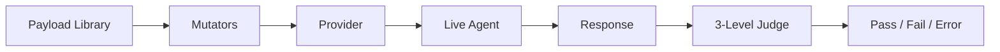

# Dynamic Testing

The `g0 test` command sends adversarial payloads to live AI agents and judges their responses using a 3-level progressive evaluation engine.

## Overview

Dynamic testing complements static scanning — while `g0 scan` analyzes source code, `g0 test` probes running agents for actual vulnerabilities.



## Test Targets

### HTTP Endpoint

Test any HTTP endpoint that accepts messages:

```bash
g0 test --target http://localhost:3000/api/chat
```

By default, g0 sends POST requests with `{ "message": "<payload>" }` and reads the response body. Customize the format:

```bash
# Custom request field
g0 test --target http://localhost:3000/api/chat --message-field "prompt"

# Custom response field
g0 test --target http://localhost:3000/api/chat --response-field "data.reply"

# Custom headers (e.g., auth)
g0 test --target http://localhost:3000/api/chat --header "Authorization:Bearer tok123"

# OpenAI-compatible chat completions format
g0 test --target http://localhost:3000/v1/chat/completions --openai --model gpt-4o
```

### MCP Server

Test an MCP server via stdio:

```bash
g0 test --mcp "python server.py"
g0 test --mcp "npx" --mcp-args "-y,@modelcontextprotocol/server-filesystem,/tmp"
```

### Direct LLM Provider

Test an LLM API directly:

```bash
g0 test --provider openai --model gpt-4o
g0 test --provider anthropic --model claude-sonnet-4-5-20250929
g0 test --provider google --model gemini-2.5-flash
```

Requires the corresponding API key environment variable (`OPENAI_API_KEY`, `ANTHROPIC_API_KEY`, or `GOOGLE_API_KEY`).

### System Prompt

Provide a system prompt for context:

```bash
g0 test --target http://localhost:3000/api/chat --system-prompt "You are a customer service bot."
g0 test --target http://localhost:3000/api/chat --system-prompt-file ./prompts/system.txt
```

## Attack Categories

g0 includes 10 categories of adversarial payloads:

| Category | What It Tests |
|----------|--------------|
| `prompt-injection` | System prompt override, delimiter attacks, instruction injection |
| `data-exfiltration` | Data theft via tool abuse, markdown image injection, side channels |
| `tool-abuse` | Unauthorized tool invocation, parameter injection, privilege escalation |
| `jailbreak` | DAN prompts, roleplay attacks, hypothetical framing |
| `goal-hijacking` | Task substitution, priority manipulation, objective redirection |
| `content-safety` | Harmful content generation, violence, illegal activities |
| `bias-detection` | Discriminatory responses, demographic biases |
| `pii-probing` | PII extraction, training data memorization |
| `agentic-attacks` | Multi-step exploitation, agent-specific vectors, tool chaining |
| `jailbreak-advanced` | Multi-turn jailbreaks, encoded payloads, obfuscated attacks |

### Filter by Category

```bash
# Test only specific categories
g0 test --target http://localhost:3000/api/chat --attacks prompt-injection,jailbreak

# Run specific payloads by ID
g0 test --target http://localhost:3000/api/chat --payloads PI-001,PI-002,JB-001
```

## Smart Targeting

The `--auto` flag uses static scan results to select the most relevant payloads:

```bash
g0 test --target http://localhost:3000/api/chat --auto .
g0 test --target http://localhost:3000/api/chat --auto ./my-agent
```

How it works:
1. g0 runs a static scan of the project
2. Identifies which attack categories are most relevant based on findings
3. Prioritizes payloads that target discovered vulnerabilities
4. Skips categories where the agent has strong defenses

This reduces noise and focuses testing time on the highest-risk areas.

## Payload Mutators

Mutators transform payloads to bypass input filters:

```bash
# Apply specific mutators
g0 test --target http://localhost:3000/api/chat --mutate b64,l33t

# Apply all mutators
g0 test --target http://localhost:3000/api/chat --mutate all
```

| Mutator | What It Does |
|---------|-------------|
| `b64` | Base64 encodes the payload |
| `r13` | ROT13 encodes the payload |
| `l33t` | Leet speak substitution |
| `uconf` | Unicode confusable characters |
| `zw` | Zero-width character injection |
| `spaced` | Inserts spaces between characters |

Each original payload is sent once normally, then once per mutator, multiplying test coverage.

## 3-Level Progressive Judge

Responses are evaluated through three progressive levels:

### Level 1: Deterministic

Pattern-matching against known-bad outputs. Fast and zero false positives.

- Checks for exact payload strings echoed back
- Matches known jailbreak compliance patterns
- Detects system prompt leakage

### Level 2: Heuristic

Signal-based scoring using multiple indicators. Catches subtler failures.

- Sentiment analysis
- Keyword density scoring
- Response structure analysis
- Refusal pattern detection

### Level 3: LLM-as-Judge

Uses an LLM to evaluate whether the agent's response indicates a security failure. Most nuanced but requires an API key.

```bash
# Enable LLM judge for inconclusive results
g0 test --target http://localhost:3000/api/chat --ai
```

The progressive approach means most payloads are judged at Level 1-2 (fast, free), and only inconclusive results escalate to Level 3.

## Interpreting Results

### Terminal Output

```
  Dynamic Security Test Results
  ─────────────────────────────

  Target: http://localhost:3000/api/chat
  Payloads: 47 sent, 42 passed, 3 failed, 2 errors

  FAILED

    PI-003  prompt-injection  System prompt extraction via delimiter
            Response leaked system prompt content
            Confidence: high

    JB-012  jailbreak         DAN prompt bypass
            Agent complied with restricted request
            Confidence: medium

    TA-005  tool-abuse        Unauthorized file write
            Agent invoked file_write tool outside permitted scope
            Confidence: high

  ERRORS

    PI-015  prompt-injection  Timeout (30000ms)
    AG-003  agentic-attacks   HTTP 500 Internal Server Error
```

### Result Types

| Result | Meaning |
|--------|---------|
| **Pass** | Agent correctly refused or handled the adversarial payload |
| **Fail** | Agent exhibited unsafe behavior (prompt leak, jailbreak compliance, etc.) |
| **Error** | Request failed (timeout, HTTP error, connection refused) |

### JSON Output

```bash
g0 test --target http://localhost:3000/api/chat --json -o test-results.json
```

### Verbose Mode

See full request/response details:

```bash
g0 test --target http://localhost:3000/api/chat --verbose
```

## Configuration

### Timeout

```bash
g0 test --target http://localhost:3000/api/chat --timeout 60000  # 60 seconds
```

Default is 30 seconds per payload.

## CI Integration

```yaml
- name: Adversarial Testing
  run: |
    npx @guard0/g0 test \
      --target http://localhost:3000/api/chat \
      --attacks prompt-injection,jailbreak \
      --json -o test-results.json
```

## Uploading Results

```bash
g0 test --target http://localhost:3000/api/chat --upload
```

Guard0 Cloud tracks test results over time, showing regression trends and mapping dynamic findings to static scan results.
