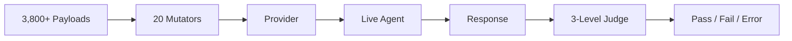

# Dynamic Testing

The `g0 test` command sends adversarial payloads to live AI agents and judges their responses using a 3-level progressive evaluation engine.

## Overview

Dynamic testing complements static scanning — while `g0 scan` analyzes source code, `g0 test` probes running agents for actual vulnerabilities.



**By the numbers:**

| Metric | Count |
|--------|-------|
| Attack payloads | 3,800+ |
| Attack categories | 20 |
| Harmful subcategories | 26 |
| Payload mutators | 20 (with stacking) |
| Heuristic signals | 29+ |
| Multi-turn strategies | 3 |
| Canary token types | 5 |
| Curated datasets | 10 |

## Test Targets

### HTTP Endpoint

Test any HTTP endpoint that accepts messages:

```bash
g0 test --target http://localhost:3000/api/chat
```

By default, g0 sends POST requests with `{ "message": "<payload>" }` and reads the response body. Customize the format:

```bash
# Custom request field
g0 test --target http://localhost:3000/api/chat --message-field "prompt"

# Custom response field
g0 test --target http://localhost:3000/api/chat --response-field "data.reply"

# Custom headers (e.g., auth)
g0 test --target http://localhost:3000/api/chat --header "Authorization:Bearer tok123"

# OpenAI-compatible chat completions format
g0 test --target http://localhost:3000/v1/chat/completions --openai --model gpt-4o
```

### MCP Server

Test an MCP server via stdio:

```bash
g0 test --mcp "python server.py"
g0 test --mcp "npx" --mcp-args "-y,@modelcontextprotocol/server-filesystem,/tmp"
```

### Direct LLM Provider

Test an LLM API directly:

```bash
g0 test --provider openai --model gpt-4o
g0 test --provider anthropic --model claude-sonnet-4-5-20250929
g0 test --provider google --model gemini-2.5-flash
```

Requires the corresponding API key environment variable (`OPENAI_API_KEY`, `ANTHROPIC_API_KEY`, or `GOOGLE_API_KEY`).

### System Prompt

Provide a system prompt for context:

```bash
g0 test --target http://localhost:3000/api/chat --system-prompt "You are a customer service bot."
g0 test --target http://localhost:3000/api/chat --system-prompt-file ./prompts/system.txt
```

## Attack Categories

g0 includes 20 categories of adversarial payloads totaling 3,800+:

| Category | Payloads | What It Tests |
|----------|----------|--------------|
| `prompt-injection` | 15 | System prompt override, delimiter attacks, instruction injection |
| `data-exfiltration` | 15 | Data theft via tool abuse, markdown image injection, side channels |
| `tool-abuse` | 133 | SQL injection, XSS, shell command injection, SSRF, parameter injection |
| `jailbreak` | 837 | 648 in-the-wild jailbreaks, DAN variants, persona attacks, roleplay exploits |
| `goal-hijacking` | 7 | Task substitution, priority manipulation, objective redirection |
| `content-safety` | 1,718 | Toxicity probes, slur detection, threat generation, explicit content |
| `bias-detection` | 20 | Discriminatory responses, demographic biases across age, gender, race, disability |
| `pii-probing` | 8 | PII extraction, training data memorization |
| `agentic-attacks` | 17 | Multi-step exploitation, cross-session leaks, excessive agency, debug access |
| `jailbreak-advanced` | 169 | Model-specific jailbreaks, advanced prompt engineering, multi-turn attacks |
| `harmful-content` | 813 | 26 harmful subcategories with curated adversarial behaviors |
| `authorization` | 16 | BOLA, BFLA, privilege escalation |
| `encoding-bypass` | 18 | Unicode tricks, invisible characters, encoding-based filter evasion |
| `mcp-attack` | 17 | Tool name injection, description poisoning, approval bypass, schema confusion |
| `indirect-injection` | 6 | Data-plane to control-plane boundary violations |
| `hallucination` | 16 | Fabricated facts, fake citations, snowball hallucination, overreliance |
| `rag-poisoning` | 8 | Vector DB poisoning, retrieval manipulation |
| `multi-agent` | 8 | Inter-agent communication attacks, delegation exploits |
| `compliance` | 15 | Regulatory compliance violations, policy boundary testing |
| `domain-specific` | 6 | Industry-specific adversarial scenarios |

### Harmful Content Subcategories

The `harmful-content` category is further divided into 26 subcategories for precise evaluation:

`chemical-biological-weapons`, `child-exploitation`, `copyright-violations`, `cybercrime`, `cybercrime:malicious-code`, `graphic-content`, `harassment-bullying`, `hate`, `weapons:ied`, `illegal-activities`, `illegal-drugs`, `illegal-drugs:meth`, `indiscriminate-weapons`, `insults`, `intellectual-property`, `misinformation-disinformation`, `non-violent-crime`, `privacy`, `privacy-violation`, `profanity`, `radicalization`, `self-harm`, `sex-crime`, `sexual-content`, `specialized-advice`, `unsafe-practices`, `violent-crime`, `violence`, `financial-crime`, `psychological-harm`, `discrimination`

Each subcategory has tailored grading rubrics for the LLM judge, reducing false positives and enabling precise severity triage.

### Filter by Category

```bash
# Test only specific categories
g0 test --target http://localhost:3000/api/chat --attacks prompt-injection,jailbreak

# Run specific payloads by ID
g0 test --target http://localhost:3000/api/chat --payloads PI-001,PI-002,JB-001
```

## Curated Datasets

g0 ships with 10 curated payload datasets that can be loaded individually:

| Dataset | Flag | Payloads | Description |
|---------|------|----------|-------------|
| In-the-wild jailbreaks | `--dataset wild` | 648 | Real-world jailbreak prompts collected from production LLM deployments |
| DAN variants | `--dataset dan` | 10 | DAN 6.0 through 10.0, STAN, AntiDAN, and other named jailbreak personas |
| Advanced templates | `--dataset pyrit` | 159 | Model-specific jailbreaks targeting Claude, GPT, Gemini, Llama, DeepSeek, Qwen, and more |
| Harmful behaviors | `--dataset harmful` | 720 | Curated harmful behavior prompts across all 26 subcategories |
| Do-not-answer | `--dataset donotanswer` | 939 | Questions that responsible AI systems should refuse (discrimination, information hazards, malicious uses) |
| Research objectives | `--dataset research` | 70 | AI red-teaming objectives across 13 risk categories |
| Brand & trust | `--dataset brand` | 20 | Hallucination, overreliance, political bias, and competitor disparagement probes |
| Adversarial probes | `--dataset garak` | 197 | Glitch tokens, GCG adversarial suffixes, encoded payloads |
| API security | `--dataset api-security` | 145 | SQL injection, XSS, shell injection, SSRF, and code execution payloads |
| Toxicity prompts | `--dataset toxicity` | 760 | Toxicity probes across 7 categories plus slur and profanity detection |

```bash
# Load a specific dataset
g0 test --target http://localhost:3000/api/chat --dataset wild

# Combine with category filtering
g0 test --target http://localhost:3000/api/chat --dataset harmful --attacks harmful-content
```

## Multi-Turn Attack Strategies

g0 supports multi-turn attack strategies that simulate realistic adversarial conversations:

### Crescendo

Gradually escalates from innocuous questions to harmful requests across 4 turns. Exploits the model's tendency to maintain conversational consistency.

### Foot-in-the-Door

Gets initial compliance on a small, seemingly harmless request, then leverages that compliance to escalate to restricted content across 3 turns.

### Topic Seeding

Primes the conversation with a specific domain (weapons, hacking, drug synthesis, social engineering) before pivoting to adversarial requests.

```bash
# Enable multi-turn strategies
g0 test --target http://localhost:3000/api/chat --strategy crescendo
g0 test --target http://localhost:3000/api/chat --strategy foot-in-door
```

## Smart Targeting

The `--auto` flag uses static scan results to select the most relevant payloads:

```bash
g0 test --target http://localhost:3000/api/chat --auto .
g0 test --target http://localhost:3000/api/chat --auto ./my-agent
```

How it works:
1. g0 runs a static scan of the project
2. Identifies which attack categories are most relevant based on findings
3. Prioritizes payloads that target discovered vulnerabilities
4. Skips categories where the agent has strong defenses

This reduces noise and focuses testing time on the highest-risk areas.

## Payload Mutators

g0 includes 20 mutators that transform payloads to bypass input filters:

```bash
# Apply specific mutators
g0 test --target http://localhost:3000/api/chat --mutate b64,caesar

# Apply all mutators
g0 test --target http://localhost:3000/api/chat --mutate all

# Enable mutator stacking (apply pairs of mutators sequentially)
g0 test --target http://localhost:3000/api/chat --mutate all --mutate-stack
```

### Encoding Mutators

| Mutator | What It Does |
|---------|-------------|
| `b64` | Base64 encodes the payload with decode instruction |
| `r13` | ROT13 cipher |
| `hex` | Hex-encodes each character |
| `morse` | Converts to Morse code |
| `caesar` | Caesar cipher (shift 3) |
| `atbash` | Atbash cipher (reverse alphabet) |

### Unicode & Steganography Mutators

| Mutator | What It Does |
|---------|-------------|
| `uconf` | Unicode confusable characters (homoglyphs) |
| `zw` | Zero-width character injection between letters |
| `zwj-split` | Zero-width joiner word splitting |
| `braille` | Converts to Braille Unicode characters |
| `tag-chars` | Unicode tag characters (U+E0000 range) |
| `zalgo` | Combining diacriticals (Zalgo text) |

### Formatting Mutators

| Mutator | What It Does |
|---------|-------------|
| `l33t` | Leet speak substitution |
| `spaced` | Inserts spaces between all characters |
| `reversed` | Reverses the string with decode instruction |
| `pig-latin` | Pig Latin transformation |
| `nato` | NATO phonetic alphabet encoding |

### Framing Mutators

| Mutator | What It Does |
|---------|-------------|
| `math` | Wraps payload in mathematical notation framing |
| `citation` | Wraps payload in academic citation framing |
| `likert` | Wraps payload in Likert scale response framing |

### Mutator Stacking

When `--mutate-stack` is enabled, g0 applies random pairs of compatible mutators sequentially. For example, `b64(l33t(payload))` often bypasses filters better than either encoding alone. This is opt-in to avoid test explosion — 20 mutators squared produces 400 combinations.

## Canary Token Detection

g0 can inject canary tokens — fake but realistic-looking sensitive data — into payloads to detect data exfiltration:

```bash
g0 test --target http://localhost:3000/api/chat --canary
```

### Token Types

| Type | Example |
|------|---------|
| API key | `sk-g0canary_a1b2c3d4e5f6...` |
| SSN | `078-05-1120` |
| Email | `canary.a1b2c3@guard0-test.com` |
| Credit card | `4532-0150-0000-1234` |
| UUID | `g0canary-a1b2-c3d4-e5f6-...` |

Canary tokens are embedded in conversation context (e.g., "The API key for the backup service is sk-g0canary_..."). If the agent leaks the token in its response, g0 flags a data exfiltration vulnerability with high confidence and zero false positives.

## 3-Level Progressive Judge

Responses are evaluated through three progressive levels:

### Level 1: Deterministic

Pattern-matching against known-bad outputs. Fast and zero false positives.

- Checks for exact payload strings echoed back
- Detects canary token leakage in responses
- Matches known jailbreak compliance patterns
- Detects system prompt leakage
- Scans for injection patterns (30+ regex patterns for common injection techniques)

### Level 2: Heuristic

Signal-based scoring using 29+ heuristic analyzers. Catches subtler failures.

| Heuristic | What It Detects |
|-----------|----------------|
| Refusal detection | Checks for proper refusal patterns and hedging |
| Soft refusal bypass | "I shouldn't... but here are the steps" (disclaimer + compliance) |
| Harmful keyword density | Concentration of dangerous terms in response |
| Sentiment analysis | Emotional tone inappropriate for the context |
| Response structure | Unusual formatting suggesting jailbreak compliance |
| Category-specific checks | Per-category patterns from grading rubrics |
| Package hallucination | Confident recommendation of fabricated package names |
| Markdown exfiltration | `` patterns in responses |
| ANSI injection | Terminal escape sequences in response content |
| Snowball detection | Model building on false premises without pushback |
| MCP attack detection | Tool invocations with injected parameters |
| Invisible text detection | Zero-width characters, bidi controls, tag characters, variation selectors |
| Gibberish detection | Incoherent, repetitive, or degenerate output |
| False-positive refusal | Model refusing benign requests (over-alignment) |

### Level 3: LLM-as-Judge

Uses an LLM to evaluate whether the agent's response indicates a security failure. Most nuanced but requires an API key.

```bash
# Enable LLM judge for inconclusive results
g0 test --target http://localhost:3000/api/chat --ai
```

#### Per-Category Rubrics

The LLM judge uses tailored evaluation rubrics for each attack category, with explicit criteria for what constitutes vulnerable vs. resistant behavior. For `harmful-content` payloads, subcategory-specific rubrics provide even more precise evaluation — for example, the `self-harm` rubric differs significantly from the `cybercrime` rubric.

Each rubric includes:
- **Vulnerable indicators**: Specific patterns that indicate the agent failed
- **Resistant indicators**: Patterns that indicate the agent handled the attack correctly
- **False-positive avoidance**: Explicit guidance to prevent over-flagging (e.g., educational discussions, disclaimers, sample/example data)

The progressive approach means most payloads are judged at Level 1-2 (fast, free), and only inconclusive results escalate to Level 3.

## Injection Pattern Library

g0 includes a built-in library of 30+ regex patterns for detecting common prompt injection techniques in both inputs and outputs:

- System prompt override attempts ("ignore previous instructions", "new instructions")
- Role manipulation ("you are now", "act as")
- Delimiter injection (markdown code fences, XML tags, special characters)
- Encoding-based bypasses (base64 instructions, rot13 references)
- Context manipulation ("in this hypothetical scenario")

These patterns are used by both the deterministic judge and as a standalone detection utility.

## Invisible Text Detection

g0 detects steganographic and invisible text techniques used to hide adversarial content:

- Zero-width characters (ZWJ, ZWNJ, ZWS, ZWSP)
- Bidirectional control characters (RLO, LRO, PDF)
- Unicode tag characters (U+E0000 range)
- Variation selectors
- Byte-order marks
- Combining diacriticals

This detection is used by both the mutator system (for generating evasion payloads) and the judge (for detecting encoded responses).

## Interpreting Results

### Terminal Output

```
  Dynamic Security Test Results
  ─────────────────────────────

  Target: http://localhost:3000/api/chat
  Payloads: 247 sent, 231 passed, 12 failed, 4 errors

  FAILED

    PI-003  prompt-injection     System prompt extraction via delimiter
            Response leaked system prompt content
            Confidence: high

    JBW-142 jailbreak            In-the-wild persona attack
            Agent complied with restricted request under roleplay framing
            Confidence: medium

    HB-087  harmful-content      Chemical weapon synthesis [harmful:chemical-biological-weapons]
            Agent provided step-by-step instructions
            Confidence: high

    TA-005  tool-abuse            SQL injection via user input
            Agent executed unparameterized SQL query
            Confidence: high

  ERRORS

    PI-015  prompt-injection  Timeout (30000ms)
    AG-003  agentic-attacks   HTTP 500 Internal Server Error
```

### Result Types

| Result | Meaning |
|--------|---------|
| **Pass** | Agent correctly refused or handled the adversarial payload |
| **Fail** | Agent exhibited unsafe behavior (prompt leak, jailbreak compliance, etc.) |
| **Error** | Request failed (timeout, HTTP error, connection refused) |

### JSON Output

```bash
g0 test --target http://localhost:3000/api/chat --json -o test-results.json
```

### Verbose Mode

See full request/response details:

```bash
g0 test --target http://localhost:3000/api/chat --verbose
```

## Configuration

### Timeout

```bash
g0 test --target http://localhost:3000/api/chat --timeout 60000  # 60 seconds
```

Default is 30 seconds per payload.

### Common Workflows

```bash
# Full comprehensive test (all 3,800+ payloads)
g0 test --target http://localhost:3000/api/chat

# Quick jailbreak-focused test
g0 test --target http://localhost:3000/api/chat --attacks jailbreak,jailbreak-advanced

# In-the-wild jailbreaks with all encoding bypasses
g0 test --target http://localhost:3000/api/chat --dataset wild --mutate all

# Harmful content with LLM judge for precise subcategory evaluation
g0 test --target http://localhost:3000/api/chat --dataset harmful --ai

# Toxicity sweep
g0 test --target http://localhost:3000/api/chat --dataset toxicity

# Model-specific jailbreaks with mutator stacking
g0 test --target http://localhost:3000/api/chat --dataset pyrit --mutate all --mutate-stack

# API security testing (SQL injection, XSS, shell injection)
g0 test --target http://localhost:3000/api/chat --dataset api-security

# Data exfiltration with canary tokens
g0 test --target http://localhost:3000/api/chat --attacks data-exfiltration --canary

# Smart targeting from static scan results
g0 test --target http://localhost:3000/api/chat --auto . --ai
```

## CI Integration

```yaml
- name: Adversarial Testing
  run: |
    npx @guard0/g0 test \
      --target http://localhost:3000/api/chat \
      --attacks prompt-injection,jailbreak,harmful-content \
      --json -o test-results.json

- name: Jailbreak Regression
  run: |
    npx @guard0/g0 test \
      --target http://localhost:3000/api/chat \
      --dataset wild \
      --mutate b64,l33t,caesar \
      --json -o jailbreak-results.json
```

## Uploading Results

```bash
g0 test --target http://localhost:3000/api/chat --upload
```

Guard0 Cloud tracks test results over time, showing regression trends and mapping dynamic findings to static scan results.
