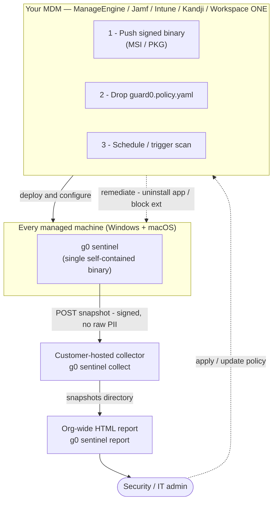
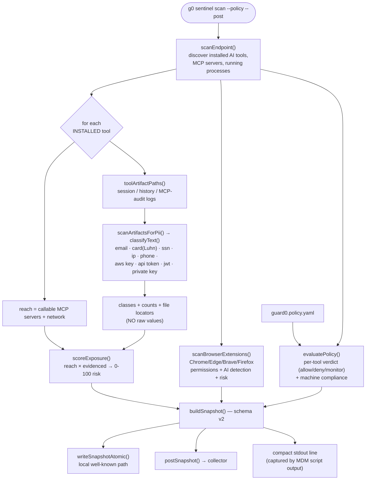
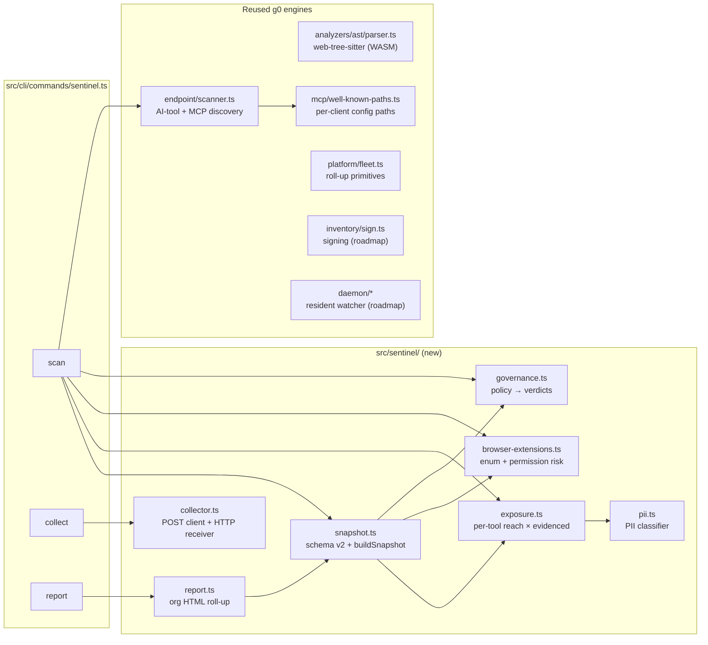

# g0 sentinel — Architecture & Functionality Overview

This document explains how the g0 sentinel works end-to-end: its deployment topology,
the scan pipeline, the module architecture, the data model, and — most importantly — the
real customer problems it solves, with concrete examples.

> **One-line:** the g0 sentinel is one MDM-deployable binary that discovers every AI tool on
> a machine, shows what PII each tool is exposed to (evidence-based, never raw values), rolls
> the whole fleet into one report, and enforces a governance policy.

Companion docs: [`g0 sentinel` command reference](sentinel.md) ·
[solution brief](solutions/mdm-ai-footprint-governance.md) ·
[full design spec](superpowers/specs/2026-07-23-g0-sentinel-fleet-ai-footprint-design.md).

---

## 1. System architecture (deployment topology)

The sentinel is **MDM-agnostic**: the MDM only pushes the binary, drops a config file, and
optionally triggers a run. Everything else is identical on every machine and every MDM.



**Why a collector?** ManageEngine Endpoint Central (and most MDMs) cannot natively pull a file
from every machine to the console. So the machine POSTs its snapshot to a small collector the
customer hosts — no SaaS required. A compact summary line is *also* captured in the MDM's own
script-output report, so results are visible inside the tool IT already uses.

---

## 2. The scan pipeline (what happens on one machine)

A single `g0 sentinel scan` is a thin orchestrator over g0's existing scanners plus the
sentinel-specific exposure/governance engines. It is **non-interactive, never prompts, and
never writes raw PII**.



---

## 3. Component architecture (modules)

Everything new lives under `src/sentinel/`; the sentinel deliberately **reuses g0's existing
engines** rather than re-implementing discovery, parsing, or scoring.



**Build & packaging:** the whole thing compiles to a **single self-contained binary** via
`bun build --compile` (Node SEA was ruled out — g0 is ESM + top-level-await + `import.meta.url`,
which SEA's CommonJS-only model can't handle). Code parsing runs on **`web-tree-sitter` (WASM)**
so there's no native dependency to compile or ship — the grammar `.wasm` files are embedded in
the binary. Measured parse throughput: **2.6 ms/parse** for a ~1.2k-line file.

---

## 4. Data model — the machine snapshot (schema v2)

Each scan produces one JSON document. **Invariant: it contains PII _classes and counts_ with a
file locator — never the raw values.**

```jsonc
{
  "schemaVersion": 2,
  "generatedAtMs": 1784865595919,
  "sentinelVersion": "2.1.0",
  "host": { "hostname": "laptop-alice", "platform": "darwin", "arch": "arm64" },

  // Full known-tool inventory with install/running state
  "tools": [
    { "name": "Claude Code", "installed": true, "running": true, "mcpServerCount": 1 },
    { "name": "Cursor",      "installed": true, "running": false, "mcpServerCount": 2 }
  ],

  // Per-tool PII exposure — reach × evidenced (installed tools only)
  "exposures": [
    {
      "tool": "Claude Code", "category": "coding-agent",
      "reach": { "mcpServers": ["github"], "network": true },
      "evidenced": { "email": 3, "api_token": 1 },       // classes + counts
      "locators": [ { "path": "~/.claude/history.jsonl", "counts": { "email": 3 } } ],
      "riskScore": 42
    }
  ],

  // Installed AI-related browser extensions with permissions + risk
  "aiBrowserExtensions": [
    { "browser": "Chrome", "name": "ChatGPT for Google",
      "permissions": ["tabs", "<all_urls>"], "isAI": true, "riskScore": 54 }
  ],

  // Fleet-mergeable roll-up of PII classes across all tools
  "piiSummary": { "email": 3, "api_token": 1 },

  // Governance verdicts (present when --policy applied)
  "governance": {
    "policyName": "corp-baseline",
    "verdicts": [ { "tool": "Claude Code", "verdict": "allow", "rule": "Claude Code" } ],
    "compliant": true
  },

  "endpointScore": 55
}
```

---

## 5. Functionality overview

| Capability | What it does | Key modules |
|---|---|---|
| **Footprint discovery** | Every installed AI desktop app, coding agent (Claude Code, Cursor, Codex, …), MCP server, and AI browser extension on the machine. | `endpoint/scanner.ts`, `browser-extensions.ts` |
| **PII exposure (per tool)** | For each tool: what it *can reach* (callable MCP servers, network) × what *did flow* — PII classes + counts over the tool's local session/history/MCP-audit artifacts. | `exposure.ts`, `pii.ts` |
| **Browser-extension risk** | Enumerates extensions across Chrome/Edge/Brave/Firefox, merges permissions, flags AI ones, and scores permission risk (CRXcavator-style). | `browser-extensions.ts` |
| **Governance** | A `guard0.policy.yaml` (allow/deny/monitor by tool name, `category:`, or glob) yields per-tool verdicts and a machine compliance flag. | `governance.ts` |
| **Fleet aggregation** | Machine POSTs its snapshot to a customer-hosted collector; snapshots accumulate in a directory. | `collector.ts` |
| **Org report** | One self-contained HTML report: fleet summary, aggregate PII, per-machine tool exposure and verdicts. | `report.ts` |
| **Single binary** | No Node/npm prerequisite; WASM parser embedded; runs unattended. | `bun build --compile` |

### PII classes detected (checksum-validated where possible)

`email` · `credit_card` (Luhn-validated) · `us_ssn` · `ipv4` (octet-validated) · `phone` ·
`aws_access_key` · `api_token` (sk-/ghp_/xox…/glpat) · `jwt` · `private_key`. Counts are of
**distinct** matches per class; raw values are never emitted.

---

## 6. What we solve for in a real customer environment

Each scenario below is something the sentinel does **today**, with the command and the shape of
the result.

### Scenario A — "What AI tools are actually on our machines?" (shadow-AI inventory)

Personal ChatGPT apps, unsanctioned coding agents, and AI browser extensions install themselves
faster than IT can track. The sentinel gives a per-machine and fleet-wide inventory.

```bash
g0 sentinel scan --post http://collector.internal:8787/
# -> laptop-alice: Claude Code, Cursor installed; ChatGPT-for-Google extension (risk 54)
```

The org report answers *"3 machines, 3 distinct AI tools, 1 non-compliant"* at a glance —
without logging into a single machine.

### Scenario B — "Is sensitive data leaking into AI tools?" (PII exposure)

A build server's coding-agent history contained deployment secrets. The sentinel surfaces this
**as evidence, not raw values**:

```
build-server-01  COMPLIANT
    installed:   Claude Code
    PII exposed: us_ssn:1  aws_access_key:1  private_key:1  credit_card:1   (risk 100)
    evidence:    ~/.claude/history.jsonl
```

You learn *a private key + AWS access key + a card + an SSN passed through this agent, and where*
— enough to act, with nothing sensitive copied into the report.

### Scenario C — "Which browser extensions can read everything?" (extension governance)

A "Monica AI" extension with `tabs`, `cookies`, `history`, and `<all_urls>` scores **risk 93**.
The report ranks AI extensions by permission risk so you can prioritize removal.

### Scenario D — "Enforce our AI policy across the fleet" (governance)

Policy: allow approved coding agents, **deny personal desktop AI apps**, monitor the rest.

```yaml
# guard0.policy.yaml
name: corp-baseline
default: monitor
rules:
  - match: "Claude Code"          # exact tool
    verdict: allow
  - match: "Cursor*"              # glob
    verdict: allow
  - match: "category:desktop-app" # whole category
    verdict: deny
```

```bash
g0 sentinel scan --policy guard0.policy.yaml --post http://collector.internal:8787/
# -> laptop-bob: NON-COMPLIANT (deny: Claude Desktop)
```

The report flags every non-compliant machine and the exact rule that tripped. IT then removes it
through the MDM (Prohibited Software / Add-on Control) — **g0 decides, the MDM enforces**.

### Scenario E — "Give the auditor a fleet-wide record" (compliance evidence)

```bash
g0 sentinel report --dir /var/guard0/snapshots --out fleet.html
# -> 3 machines, 3 tools, 10 PII items, 1 non-compliant
```

One self-contained HTML file: fleet summary, aggregate PII exposure by class, and per-machine
tool/exposure/verdict tables — a portable record of AI usage and PII exposure across the estate.

### Scenario F — "Which machines had that risky MCP server?" (incident response)

Because each snapshot records the MCP servers each tool can reach, a fleet of collected
snapshots is queryable after the fact: filter for a specific server name or a spike in a PII
class to scope an incident to the exact machines.

---

## 7. Security & privacy invariants

- **No raw PII, ever** — snapshots and reports carry PII *classes + counts + a file locator*,
  never the values. Verified end-to-end (planted secrets are absent from every snapshot and the
  report).
- **Local-first** — snapshots go to a collector *you* host; no Guard0 SaaS is involved. Platform
  sync is an optional later upgrade.
- **Evidence-based, not interception** — exposure is proven from local artifacts + declared
  permissions/scopes, with no TLS interception or inline DLP.
- **Fail-safe & unattended** — the scan never prompts, never blocks, and on error emits a single
  clean line and a non-zero exit (no stack traces) so an MDM can flag the machine.
- **Well-behaved on the endpoint** — the deployed posture is a scan-and-report agent, not a hot
  filesystem watcher, to avoid EDR/AV collisions and laptop resource cost.

---

## 8. Status: shipped vs. roadmap

**Shipped:** footprint discovery (incl. AI browser extensions), per-tool PII exposure,
collector, org HTML report, governance policy + per-tool verdict, single self-contained binary.

**Roadmap (needs certs / a Windows host / customer env):** signed MSI + notarized PKG installers,
Windows runtime, live ManageEngine deployment, snapshot signing (reuse `inventory/sign.ts`), the
resident daemon (`sentinel start`, reuse `src/daemon/`), and the MDM-enacted remediation manifest.

---

## 9. Command reference

```bash
# on every machine (via MDM):
g0 sentinel scan [--out <path>] [--post <url>] [--policy <file>] [--no-pii]

# on a central box you control:
g0 sentinel collect --dir <dir> [--port 8787] [--host 127.0.0.1]

# any time, to see the whole fleet:
g0 sentinel report --dir <dir> [--out report.html]
```
